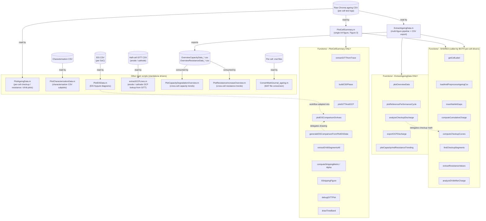

# Analysis of NMC Dataset

This repository contains Python and MATLAB scripts for analyzing and visualizing battery test data from NMC (Nickel Manganese Cobalt) cells for the NextBMS project.

## Overview

The scripts enable analysis of:
- **Cyclic ageing data** - Battery degradation during charge/discharge cycles
- **Calendar ageing data** - Battery degradation over time during storage
- **Characterization data** - Initial battery characterization measurements
- **EIS (Electrochemical Impedance Spectroscopy) data** - Nyquist diagram visualization

## Repository Structure

```
├── README.md                     # This file
├── ageing_test_plan.md           # Complete test matrix and configurations
├── requirements.txt              # Python dependencies
├── fileDependencies.txt          # List of function dependencies
│
├── matlab_scripts/               # MATLAB analysis scripts
│   ├── ExtractAgeingData.m        # Main per-cell ageing pipeline (multi-figure + Overview CSV export)
│   ├── PlotCellSummary.m          # One-page A4 per-cell publication summary (Figure 3)
│   ├── PlotCharacterizationData.m # Combined characterisation figure (characterization_combined.pdf)
│   ├── PlotEISData.m             # EIS Nyquist diagram plotting
│   ├── extractOCPLines.m         # Anode/cathode OCP figures (Anode.pdf / Cathode.pdf)
│   ├── PlotCapacityDegradationOverview.m  # Cross-cell capacity degradation trends
│   ├── PlotResistanceIncreaseOverview.m   # Cross-cell resistance increase trends
│   ├── PlotLiStrippingMethods.m   # Li-stripping methods figures (LiStrippingMethods_a/b)
│   ├── PlotReferencePerformanceCycleFigure.m # RPC publication figure driver (cell A1.05_Cell_68)
│   ├── ConvertMat4Journal_ageing.m        # Convert per-cell .mat -> open-dataset CSV
│   └── CopyToPublicRepository.m   # Dependency analysis + copy scripts/functions to public repo
│
├── ../Functions/                 # Shared MATLAB helper library (sibling folder,
│   │                             # added to the path by each driver via addpath)
│   ├── loadAndPreprocessAgeingCsv.m  # CSV load + time reconstruct + gaps + cum. charge
│   ├── computeCheckupCurves.m        # Per-checkup capacity / voltage / dQ-dV formula
│   ├── insertNaNAtGaps.m             # Break traces at time gaps
│   ├── computeCumulativeCharge.m     # Cumulative capacity integral
│   ├── findCheckupSegments.m         # Detect C/50 discharge segments
│   ├── extractResistanceValues.m     # 30 s DC-pulse resistance
│   ├── analyzeDVdtAfterCharge.m      # dV/dt (Li-stripping) segments
│   ├── analyzeCheckupDischarge.m     # Checkup plots + SoC/OCV (delegates the math)
│   ├── extractGITTfromTrace.m        # GITT episode / per-pulse OCV detector
│   ├── buildC50Phase.m               # C/50 discharge+charge on a shared signed-Q axis
│   ├── plotGITTAndOCP.m              # BoL/EoL GITT OCV + C/50 OCP overlay panel
│   ├── plotEISComparisonOnAxes.m     # Nyquist BoL/MoL/EoL drawing routine
│   ├── generateEISComparisonFromPlotEISData.m # Standalone EIS export (delegates)
│   ├── extractDVdtSegmentsAll.m      # Every post-charge C/5 dV/dt segment
│   ├── computeStrippingMetric.m      # Li-stripping metric per segment
│   ├── computeStrippingAlpha.m       # Power-law dV/dt fit exponent / RMSE
│   ├── liStrippingFigure.m           # Standalone Li-stripping diagnostic figure
│   ├── debugGITTPlot.m               # GITT diagnostic figure
│   ├── drawTimeBand.m                # Semi-transparent time band overlay
│   ├── getCellLabel.m                # Cell-ID -> human-readable label
│   └── ...                           # Other shared helpers
│
├── python_scripts/               # Python analysis scripts
│   ├── PlotAgeingData.py         # Python version of ageing analysis
│   ├── PlotCharacterizationData.py # Python characterization visualization
│   ├── PlotEISData.py            # Python EIS visualization
│   ├── ExtractAgeingData.py      # Python data extraction
│   ├── PlotCapacityDegradationOverview.py # Python capacity trends
│   ├── PlotResistanceIncreaseOverview.py  # Python resistance trends
│   └── extractOCPLines.py        # Python OCP line extraction
│
├── docs/                         # Documentation and project tracking
│   ├── rules.md                  # Business rules and constraints
│   ├── done.md                   # Completed work log
│   ├── todo.md                   # Task backlog and ideas
│   ├── assumptions.md            # Analysis assumptions
│   └── figures/                  # Generated figures (publication-ready)
│
└── pngs/                         # PNG output directory
```

## Ageing Test Plan

See [ageing_test_plan.md](ageing_test_plan.md) for the complete test matrix including:
- **0°C** - 8 cells testing temperature effects, C-rate variations, and validation cycles
- **25°C** - 11 cells testing DoD effects, C-rate effects, and validation cycles  
- **45°C** - 14 cells testing SOC effects, average SoC, high voltage, C-rate, and validation cycles
- **0°C – 45°C (Dynamic)** - 5 cells with dynamic temperature profiles for validation

### Experiment metadata

The ageing experiment metadata - the full calendar/cyclic test matrix and the per-cell
test conditions (temperature, average SoC, DoD, charge/discharge C-rates, voltage limits and
dynamic profile) - is documented in [ageing_test_plan.md](ageing_test_plan.md) in this
repository. It is no longer shipped as a separate `experiment_metadata.xlsx` in the dataset;
refer to `ageing_test_plan.md` as the authoritative experiment/metadata reference.

## Cell Characterization

Electrical characterisation parametrises the cell models. It was performed on three cells
(`Cell_4`, `Cell_6`, `Cell_15`) in a Weiss Technik 81002 climate chamber,
cycled with a Chroma 7100 Cell Cycler (100 A/channel, ±5 V); EIS used an Ivium 5000. The
procedure (plotted by [`PlotCharacterizationData.m`](matlab_scripts/PlotCharacterizationData.m),
e.g. cell `Cell_6`) consists of:

- **Initialization** - 5× CC-CV C/4 charge + C/4 CC discharge for a uniform starting state.
- **GITT** - charge & discharge OCV curves; 25 rest points per direction, 0.2C pulses with
  adaptive rest at 25 °C, plus a temperature sweep every 5th point.
- **CC cycling** - C/20 charge/discharge at 25, 45, 5 and −5 °C, then 0.1C/0.2C/0.5C/1.0C at 25 °C.
- **Dynamic cycles** - two drive-cycles at −5/5/25/45 °C and 0/15/25/35 °C, charge and discharge.
- **HPPC** - 30 s pulses at 0.1C–1.5C with 10 min rest, at 25/5/45 °C and 100/80/60/40/20/0 % SoC.
- **EIS** - galvanostatic 5.8 A, 100 kHz–10 mHz, at 90/50/10 % SoC and 0/5/25/45 °C.

Data: `Characterization_data/<cell>/` with one CSV per phase.

## Half-cell Testing

A single pristine cell (`Cell_96`) was opened (teardown) and its electrodes harvested as 15 mm
coins, then assembled into 2032 coin-cell half-cells against a lithium chip (polypropylene
separator, 500 µL LP30 = 1 M LiPF₆ in EC:DMC 1:1 v/v) to measure the electrode Open-Circuit
Potentials (OCPs):

- **NMC 532 cathode** - OCP between 2.8 and 4.4 V vs Li/Li⁺, via a full C/20 charge/discharge
  and a charge/discharge GITT (C/20–C/50 pulses).
- **Graphite anode** - one full cycle between 0.01 and 2 V vs Li/Li⁺, plus a GITT between
  0.01 and 1.5 V.

Data: `OCP_data/Cathode_NMC532/` and `OCP_data/Anode_Graphite/` CSVs, processed by
[`extractOCPLines.m`](matlab_scripts/extractOCPLines.m) into the anode/cathode OCP lookup
curves (`Anode.pdf`, `Cathode.pdf`).

## Requirements

### Python
- Python 3.9+
- NumPy
- Pandas
- Matplotlib
- SciPy

### MATLAB
- MATLAB R2022a or later

## Usage

### Python

```bash
# Navigate to python_scripts directory
cd python_scripts

# Run ageing data analysis
python PlotAgeingData.py

# Run characterization data visualization
python PlotCharacterizationData.py

# Run EIS data visualization
python PlotEISData.py

# Run OCP line extraction
python extractOCPLines.py
```

### MATLAB

```matlab
% Add paths (from MATLAB command window)
addpath(genpath('..\'));  % Add current project to path

% Run the main per-cell ageing pipeline
cd matlab_scripts
ExtractAgeingData

% Build the one-page A4 per-cell summary (Figure 3)
PlotCellSummary

% Run characterization data visualization
PlotCharacterizationData

% Run EIS data visualization
PlotEISData

% Run OCP line extraction
extractOCPLines
```

## Main Scripts

### `ExtractAgeingData`
Loads battery cell test data, processes time gaps, calculates cumulative charge capacity, and performs diagnostic analyses including:
- Checkup capacity measurements
- Resistance calculations
- dV/dt analysis after charging

It exports per-cell figures to `pngs/` and the cross-cell `OverviewCapacityData_*.csv` / `OverviewResistanceData_*.csv` tables consumed by the overview plotters.

### `PlotCharacterizationData`
Visualizes initial characterization data from CSV files. Generates figures with multiple subplots for each data column.

### `PlotEISData`
Loads impedance data from CSV files and generates Nyquist diagrams for different State of Charge (SoC) conditions.

### `extractOCPLines`
Builds anode and cathode OCP-like lookup curves from GITT pulse data, creates diagnostic plots for the detected pulse boundaries, and saves publication-ready PNG figures.

### `PlotCellSummary`
Builds the one-page A4 per-cell publication summary (Figure 3). The A4 portrait layout is a
7-row `tiledlayout`:

1. Current vs time (full width)
2. Voltage vs time (full width)
3. Temperature (cell + chamber) vs time (full width)
4. Checkup capacity (left axis) and 30 s DC resistance (right axis) vs age (full width)
5. Li-stripping (power-law dV/dt fit RMSE) vs age (full width)
6-7. A 2x2 block of diagnostic tiles: dQ/dV and EIS Nyquist (row 6), OCV (BoL/EoL GITT +
   C/50 overlay) and C/50 OCP curves (row 7).

Each downstream analysis is colour-linked to its source time window via a per-checkup
`parula` colour thread (semi-transparent bands on the top I/V/T panels). The script calls
shared `../Functions/` helpers only; it defines no local functions. It exports
`<cellNum>_Summary.{png,pdf}` and a standalone `EISComparison.{pdf,png}` to `pngs/`.

## Software Architecture: Code Reuse (`PlotCellSummary.m` vs `ExtractAgeingData.m`)

This section documents what is shared between the two main per-cell MATLAB drivers,
`matlab_scripts/ExtractAgeingData.m` (the original multi-figure + CSV pipeline) and
`matlab_scripts/PlotCellSummary.m` (the single A4 publication figure, Figure 3).

### High-level view

The two per-cell drivers are thin top-level scripts on top of a common `../Functions/`
helper library. As of the 2026-07-28 refactor, **every** helper lives in its own file under
`Functions/`: `PlotCellSummary.m` contains no local functions, and the two formulas that used
to be copy-pasted between the drivers (the CSV data-ingestion preamble and the per-checkup
OCV/Q/dQ-dV math) are now single-source helpers (`loadAndPreprocessAgeingCsv`,
`computeCheckupCurves`).

The remaining main scripts are **standalone drivers**: they do not call the shared
`Functions/` ageing helpers. The two cross-cell overview scripts instead consume the
`Overview*Data_*.csv` tables that `ExtractAgeingData.m` exports, and `PlotEISData.m`'s Nyquist
workflow was the template later adapted into `plotEISComparisonOnAxes`.



### 1. Shared `Functions/` helpers (called by BOTH drivers)

| Helper | Role |
|---|---|
| `getCellLabel` | cell-ID -> human-readable label |
| `loadAndPreprocessAgeingCsv` | CSV load + time reconstruction + NaN-gap insertion + cumulative charge (single-source ingestion) |
| `insertNaNAtGaps` | break traces at time gaps |
| `computeCumulativeCharge` | cumulative capacity via integral of current |
| `computeCheckupCurves` | per-checkup capacity / voltage / dQ-dV formula (single-source checkup math) |
| `findCheckupSegments` | detect constant-current C/50 discharge segments |
| `extractResistanceValues` | 30 s DC-pulse resistance extraction |
| `analyzeDVdtAfterCharge` | dV/dt (Li-stripping) segment analysis |

### 2. `Functions/` helpers used only by `ExtractAgeingData.m`

`plotOverviewData`, `plotReferencePerformanceCycle`, `analyzeCheckupDischarge` (which now
*delegates* its math to `computeCheckupCurves` and only adds FEC + SoC/OCV interpolation +
plotting), `exportOCPDischarge`, `plotCapacityAndResistanceTrending`, plus the in-script
cross-cell accumulation tables (`OverviewResistanceData_*.csv`, `OverviewCapacityData_*.csv`).

### 3. `Functions/` helpers used only by `PlotCellSummary.m`

All of the Figure-3 machinery is now in `Functions/` (previously local functions in the
script): `extractGITTfromTrace`, `buildC50Phase`, `plotGITTAndOCP`, `plotEISComparisonOnAxes`,
`generateEISComparisonFromPlotEISData` (delegates to `plotEISComparisonOnAxes`),
`extractDVdtSegmentsAll`, `computeStrippingMetric`, `computeStrippingAlpha`,
`liStrippingFigure`, `debugGITTPlot`, `drawTimeBand`.

### 4. What remains re-derived (single-driver, by design)

`PlotCellSummary.m` still detects the C/50 **charge** segments inline (a small mirror of
`findCheckupSegments`, which returns discharge segments only) before pairing them with
`buildC50Phase`, and it uses `extractDVdtSegmentsAll` (every post-charge dV/dt segment)
rather than `analyzeDVdtAfterCharge` (which returns only five). These are single-driver
choices, not cross-driver copies.

### 5. Summary

- **Single-source everywhere:** the data-ingestion preamble and the checkup formula are now
  shared helpers, so a change to the CSV column convention or the checkup acceptance test is
  made in exactly one place.
- **No local functions:** both drivers are thin; all reusable logic lives in `Functions/`.
- **Disjoint feature sets:** `ExtractAgeingData.m`'s figure/CSV exporters and
  `PlotCellSummary.m`'s GITT/Li-stripping/EIS publication code share nothing beyond the
  common `Functions/` helpers in section 1.

## Data Format

The scripts expect CSV files organized in the following structure:
- `Cyclic_ageing_data/` - Cyclic ageing test data
- `Calendar_ageing_data/` - Calendar ageing test data
- `Characterization_data/` - Initial characterization data
  - Each cell folder may contain an `EIS/` subfolder with `*_impedanceData.csv` files

## License

This project is licensed under the MIT License - see the [LICENSE](LICENSE) file for details.

## Validation Results

- **2026-08-04 - Anode legend preview update:** `extractOCPLines.m` was updated so the anode legend has no standalone `Relaxation` entries; instead, both GITT legend samples render dashed + marker while relaxation points remain on the plotted data. Updated `pngs/Anode.pdf` was deployed to `DataPaper/Figures/OCP/Anode.pdf`; width remains 216 bp (85.7% of 252 pt).
- **2026-08-04 - Anode/cathode publication figures:** `extractOCPLines.m` completed and exported `pngs/Anode.pdf` and `pngs/Cathode.pdf`; both MediaBoxes are 216 x 172 bp (85.7% of the paper's 252 pt single-column width). Both PDFs embed Times New Roman, were copied byte-for-byte to `DataPaper/Figures/OCP/`, render without clipping, and compile successfully in the paper. MATLAB diagnostics are clean; the compile retains only pre-existing reference/citation warnings.
- **2026-08-04 - Combined characterization publication figure:** `PlotCharacterizationData.m` completed and exported `pngs/characterization_combined.pdf` with a 443 bp MediaBox width (84.9% of the paper's 522 pt double-column width). The PDF was copied to `DataPaper/Figures/Characterization/`; the paper quick compile completed successfully. Times New Roman is embedded, MATLAB diagnostics are clean, and a 400 dpi raster comparison measured the figure/caption `GITT` text at 29/28 px black-ink height, consistent with the 8 pt caption target.

## Authors

Róbinson Medina, Feye Hoekstra

## Acknowledgments

This work is part of the NextBMS project for battery management system research.
